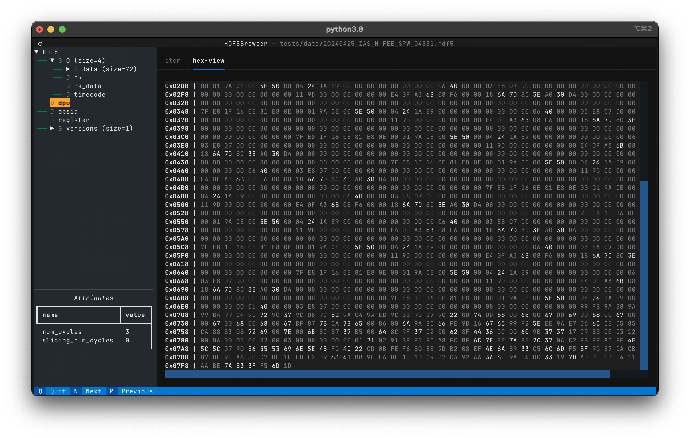
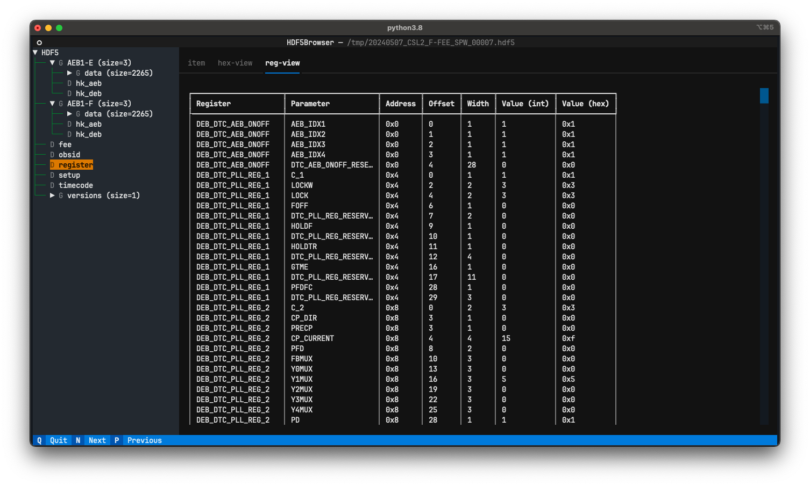
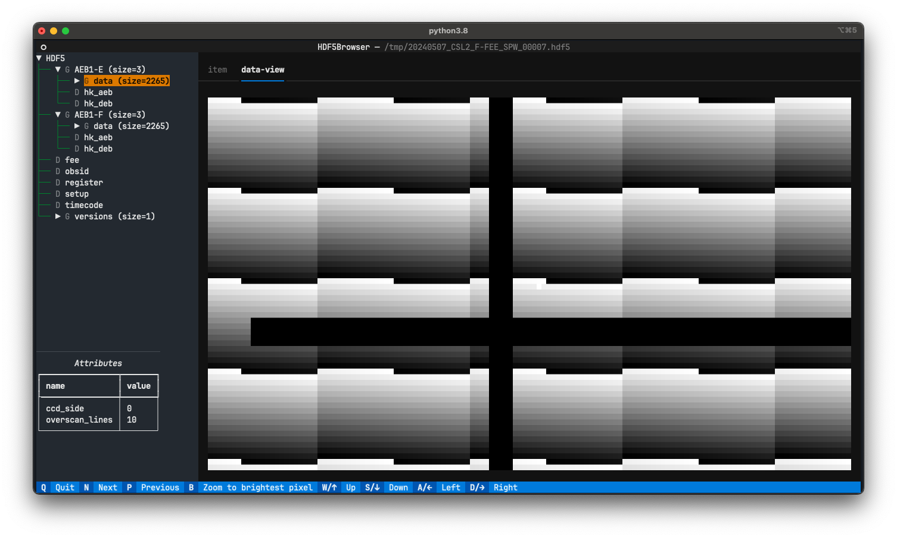
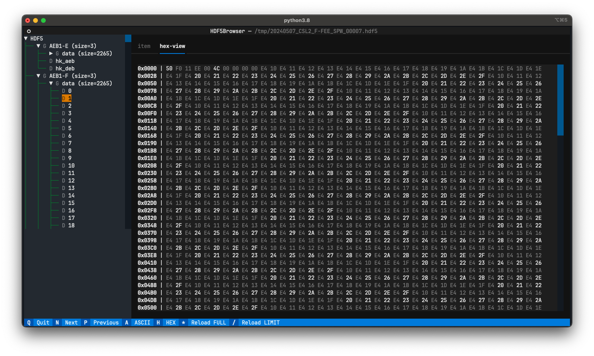
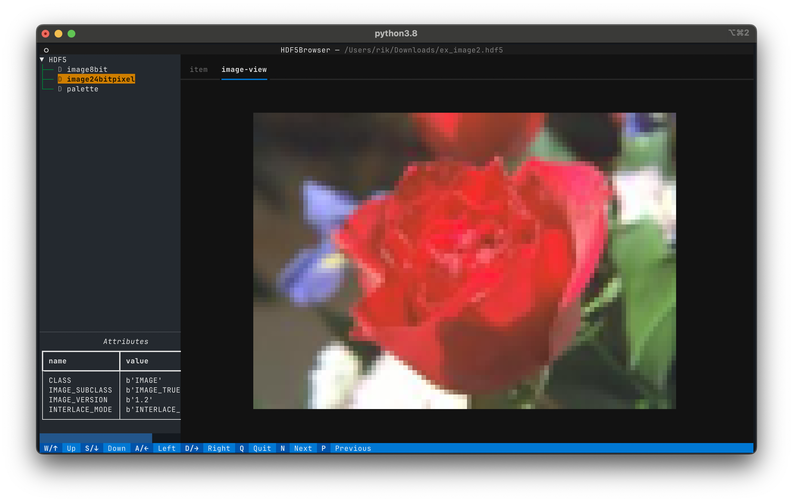

= A Terminal App for inspecting HDF5 files
:source-highlighter: rouge
:toc: left

[.text-right]
This documentation is for `h5ui` ≥ v0.1.10. image:images/github.png[link=https://github.com/rhuygen/hdf5_ui,width=40px]

== What is `h5ui`?

This is a small project written in Python and making use of the wonderful https://github.com/Textualize/textual[Textual] library that is being developed by https://www.textualize.io[Texualize].

The aim of this app is to allow you to quickly inspect an HDF5 file. By inspection, I mean, to check the structure of the file, which groups and datasets have been defined, which items have attributes associated, and of course look at the data itself. This app is designed to be extensible by plugins that visualise groups and datasets for your specific needs. The <<develop-plugins>> section below explains how to write your own plugins.

== Installation

The best way to install the app now is to use `pip install h5ui` in your virtual environment for the project where you need this tool. I'm working on a possibility to install with `pipx` but currently it can not find the default plugins when installed this way.

== Usage

You can start the app from the commandline. Provide the path to the HDF5 file as an argument, e.g.:

----
$ h5tui /tmp/20240507_CSL2_F-FEE_SPW_00007.hdf5
----

== Anatomy of the `h5tui` app

The layout of the app is rather straight forward. Let's look at a typical HDF5 file I'm using for work.

The left part of the Terminal visualises the structure of the HDF5 file in a tree like structure. You can see there are several groups and datasets reflected here. Groups have a size indication next to their name, indicating how many datasets are inside that group. You can navigate this tree with your keyboard or with your mouse. To open up a group, select its name and press return or click on the small triangle.

Selecting a node by pressing return or clicking it with the mouse will visualise its content in the main part of the Terminal. The picture above shows a https://rich.readthedocs.io/en/stable/tables.html[Rich Table] of a memory map in an instrument we are testing. This table is generated with a simple custom plugin created for our project.

In the picture below I selected a group `data`, which contains 2265 datasets. This group is also associated with a custom plugin that will combine the datasets into an image and visualises that in the app. The image in the picture below is zoomed in and represents pattern test data for our instrument. You can see at the bottom in the (blue) footer a number of additional keys that can be used to navigate in the image.

Whenever a node is highlighted and it has attributes associated, the attributes will be shown in the bottom-left part of the terminal.

By default, the `h5tui` app comes with two plugins: `HexViewer` and `ImageViewer`.

The `HexViewer` plugin will display a hexadecimal representation of your dataset when it is a one-dimensional numpy array. This is shown in the figure below where I selected one dataset from the `data` group. The HexViewer allows you to switch between hexadecimal or ASCII.

The standard `ImageViewer` will visualise image data from your HDF5 file whenever it encounters two- or three-dimensional data that can be converted into a https://pillow.readthedocs.io/en/stable/reference/Image.html[Pillow] image.

[#develop-plugins]
== Developing a Plugin

When you write your own plugin, you can use the default plugins as simple examples. Plugins are based on `entrypoints` that are defined in the `pyproject.toml` configuration file. The default plugins are defined as follows:

----
[project.entry-points."h5ui.item.view"]
hex-view = 'plugins.hex:HexViewer'
image-view = 'plugins.image:ImageViewer'
----

The idea is that you develop a Textual Widget that represents the group or dataset that you need to visualise. This widget will be added in a https://textual.textualize.io/widgets/tabbed_content/#textual.widgets.TabPane[TabPane] in a https://textual.textualize.io/widgets/tabbed_content/[TabbedContent]. But there are a number of things I need before creating this widget. I first need to know if your plugin in capable of handling the data/content in the HDF5 node that you have selected in the tree structure. If it is, then I would need a name for the TabPane and I need a way to create the widget passing it the node information and data.

The classes `HexViewer` and `ImageViewer` are the entrypoints and they implement three required methods that are used by the `h5tui` app to retrieve the information needed to use the plugin. The methods to implement are defined in the class `h5tui.HDF5ItemViewer`.

----
class HDF5ItemViewer(ABC):
    @staticmethod
    @abstractmethod
    def can_handle(item: Union[h5py.File, h5py.Group, h5py.Dataset]) -> bool:
        ...

    @staticmethod
    @abstractmethod
    def get_widget(item: Union[h5py.File, h5py.Group, h5py.Dataset]) -> Widget:
        ...

    @staticmethod
    @abstractmethod
    def get_id() -> str:
        ...
----

The `can_handle()` is used to determine if the plugin is capable of visualising the data associated with the item passed in. The item can be a File, Group or Dataset object from the HDF5 file. It is the node on which was clicked or that was selected by pressing return.

When the plugin can handle the item data, the app requests the id of the plugin (`get_id()`), this string will be used as the title for the tab that will be created.

The last thing is to request the Widget that will be added in the tab pane with the id as title. The `get_widget()` method receives the same item argument as was passed into the `can_handle()` method. In the case of the HexViewer, the widget is named `HexView` and is a `VerticalScroll` that serves a `RichLog` widget. The widget is populated in the `on_mount()` method.

I usually use `...Viewer` as the entrypoint and `...View` as the name for the widget.
